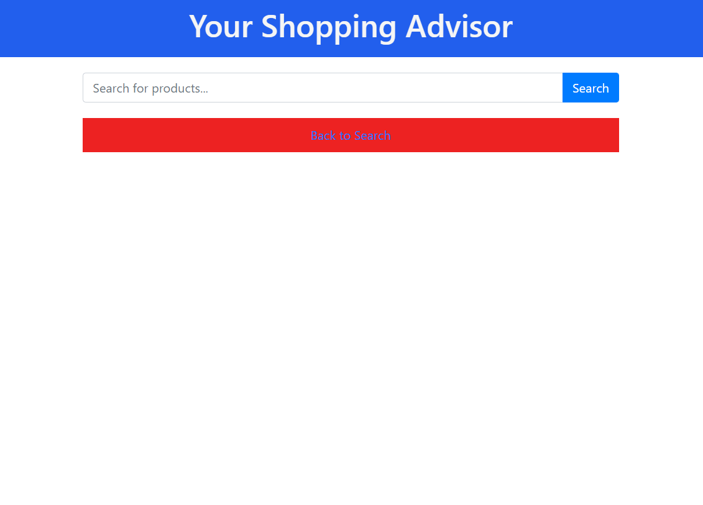
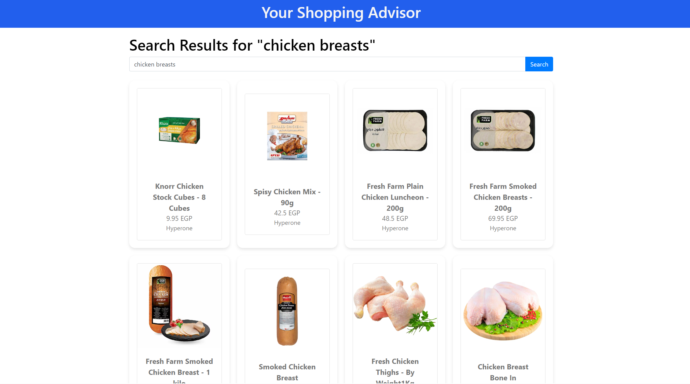

# Your Shopping Advisor

## Project Description
This project is a web scraping application that allows users to search for products across multiple vendors and compare prices. The application is built using Flask, Selenium, and BeautifulSoup, and is optimized for concurrent scraping and performance.

## Author
Mohamed Samir [Linkedin](www.linkedin.com/in/mohamed-el-shirbiny-155b0a128)

## Blog Post
[creating a web scraping and aggregation web app with flask and selenium](https://medium.com/@mohamedelshirbiny23/creating-a-web-scraping-and-aggregation-web-app-with-flask-and-selenium-dce73b6d49a1)


## Features
- Concurrent scraping from multiple vendors (Carrefour, Hyperone, Oscar)
- Sorts search results by price in ascending order
- Error handling and resource management
- Dockerized for easy deployment

## Installation

### Using Virtual Environment

1. Clone the repository:
    ```sh
    git clone https://github.com/your-username/your-repo-name.git
    cd your-repo-name
    ```

2. Create and activate a virtual environment:
    ```sh
    python3 -m venv venv
    source venv/bin/activate
    ```

3. Install the dependencies:
    ```sh
    pip install -r requirements.txt
    ```

4. Run the application:
    ```sh
    python app.py
    ```

### Using Docker

1. Build the Docker image:
    ```sh
    docker build -t shopping-advisor .
    ```

2. Run the Docker container:
    ```sh
    docker run -p 5000:5000 shopping-advisor
    ```
## Usage
Enter the name of the product you are looking foor in the search box and the results will be shown sorted in ascending order.



## Contributing
Contributions are welcome! Please submit a pull request or open an issue to discuss your ideas.

## License
This project is licensed under the MIT License.
